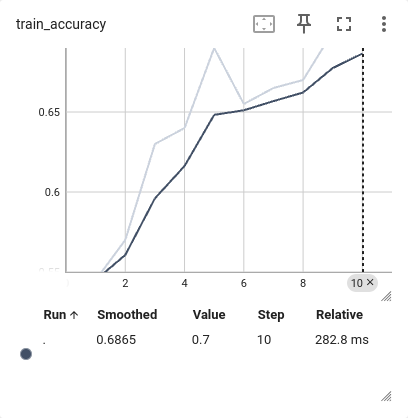

# Ferrybox data

We also train ML models on the data from NIVA ferrybox observational programs.
These programs provide surface measurements of several seawater parameters following tracks of some ships, e.g. Oslo-Kiel, Tromso-Longyearbean, etc.

## Input data

For this project we extract temperature, salinity, and fluorescence snippets from a Color Fantasy cruise ship ferrybox track (Oslo-Kiel) records.
We use surface measurements from 59.7 latitude northwards until Color Fantasy docks in Oslo.
Then we interpolate / extrapolate snippets to the same length (30 points).

An example track snippet:

We also use the river discharge data from 3 observation stations around Oslo: Solbergfoss (Glomma), Mjøndalen bru (Drammen), and Bjørnegårdssvingen (inner Oslo fjord).

Input data example before normalization:

For training we use temperature and salinity values (horizontal profiles, 30 points each) and 3 rivers discharge values.

## Labeling

First, we calculate the mean values of fluorescence in snippets.
Lets denote them `fluo`.
Then, we label a snippet 1 (bloom) if the next timestamp (should be in less than in three days) `fluo` > 3 and its larger than the current `fluo`.

## Results

Similar to the modeled data, for principal component analysis and a decision tree classifier training instead of snapshots we use increments of variables for 1 and 2 successive periods.
For deep learning classification we use 3 successive snapshots as input data for a training point.
We normalize all the data columnwise (through time).

All data is balanced (equal amount of points with label=0 and label=1).
The data used for training and testing is sepatated temporaly.
This is the best approach for autocorrelated (correlation over time) data.
For tests we take all data after 2015.

### Principal Component Analysis (PCA) and a Decision Tree Classifier

PCA on the ferrybox data shows that the projected data is evenly distributed in 'bloom' and 'no bloom' datasets.
That means that the current data vectors cannot be separated between 'bloom' and 'no bloom' very well.
The decision tree classifier we trained on the data couldn't achieve accuracy more than 50%, thus no better than a random classifier.

### Deep Learning Classification

A deep learning classifier performs better than a random or a decision tree classifier.
To prevent overfitting we use a tiny network with [13, 7, 13, 2] features.
Also, we trained the network just for 10 epochs (1 epoch is training with all data in a dataset).

Train dataset | Test dataset
:------------:|:-------------:
 | 
 | 

Test loss and accuracy improves with time, so the classifier learns to distinguish 'bloom' from 'no bloom'.

A test year predictions, red triangles - labels 1 (bloom):

Visually predictions are close to label=1 points, but do not match them too often.
There are many false positives.
Most of accuracy comes from prediction 'no bloom' points.
In 2015 there is actually only 1 huge bloom (in autumn) and therefore only 1 point we are really interested to predict.
(A spring blooms wasn't catch apparently due to missing observations).
It isn't labeled 1, that means that there was a gap in data before or while the bloom.
The classifier couldn't predict that bloom.

## Conclusion

Training a ML model on the observational data only is possible.
But using only ferrybox data is not enough, except temperature and salinity horizontal surface profiles we need other data.
In this project we used rivers discharge data from the nearby to the ferrybox track observational stations.

Before using rivers discharge in input data we tried to predict blooms using only temperature and salinity horizontal surface profiles.
The test loss and accuracy in that case didn't improve, but the train loss and accurace improved over the time.
This means that the neural network could remember the specific temperature and salinity profiles patterns corresponding to blooms, but couldn't generalize them.
It could happen because of 2 reasons: not enough data, temperature and salinity profiles doesn't have enough information to predict blooms.

Addinig rivers discharge into input data enabled learning.
We assume that adding other data about precipitations, nutrients from the observation stations, etc. can improve the accuracy of predictions.

Unfortunately, addinig new parameters to the observational vector cannot fix the main problem of using observations only for a ML model training - not enough data.
There are usually only 2 blooms per year, in spring and autumn.
For 20-25 years of ferrybox data we have that means only at most 50 points of blooms we want to predict.

But the ferrybox data is still can be valuable.
We need to combine modeling and observations in the data driven model.
