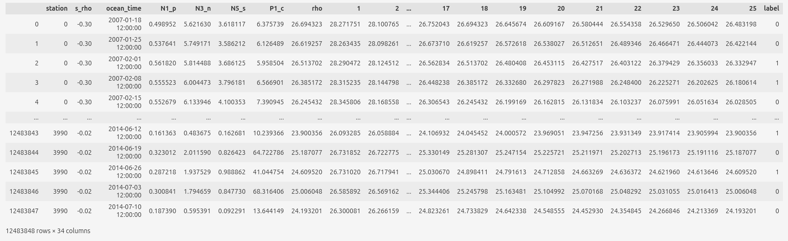
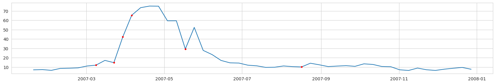
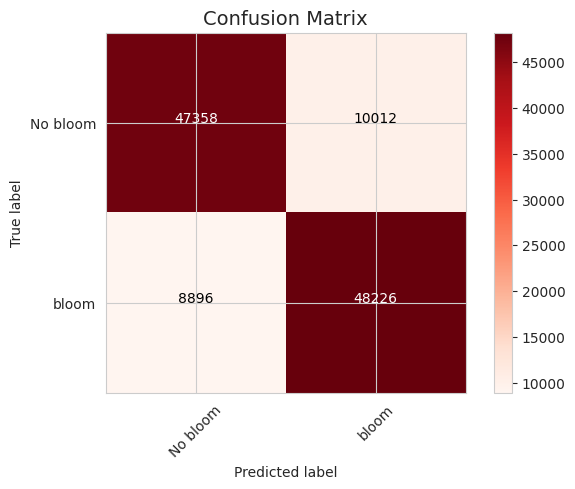
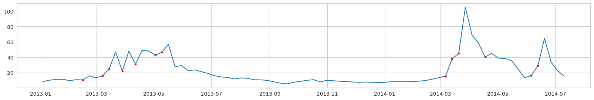
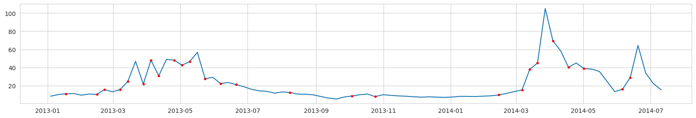
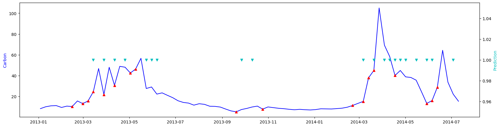

# Modeled data

The idea is to take the modeled data and train a machine learning (ML) model on that data, then use it on the observational data.
The reason - hydry-physical-biogeochemical models can't predict very well the exact time and location of algae blooms but they reproduce the physics/biogeochemistry of it.
Thus, the intuition to check is that if a ML model trained on modelled data can predict blooms on observational data.
We train a neural net model to distinguish bloom events (label = 1) from all other conditions (label = 0).

## Input data

We use the modeled data, which comes from the ROMS+NERSEM hydro-physical-biogeochemical model of the Hardangerfjord system (the western Norway around Bergen) and has weekly averages of plenty of seawater parameters.
The input data for the neural net model includes modeled nutrients (PO4, NO3, Si) and density profiles at different ROMS nodal points.
We do not take more parameters to be closer to real observations we can get from existing monitoring programs.
The data spans from 2007 to 2014.

## Labeling

Labeling is based on future increments of diatoms carbon concentration.
Label is 1 when ‘normalized next week carbon’ - ‘normalized current week carbon’ > 0.2.
All other points are label = 0.

Example of input data and labels (before normalization):

For predictitons we use:
`N1_p` is PO4,
`N3_n` is NO3,
`N5_s` is Si
and density profiles (1 to 25 columns).

Labeling example, Diatoms Carbon concentration (mg/l) from a ROMS nodal point (station) during a modeled year:

Red dots - label = 1 (bloom is expected at the next time step).

**NOTICE**: the actual task is to predict the point of the first bloom accurance.
Unfortunately, if we label data this way we will have too few points labeled as 'bloom'.
And after data balancing almost no data will left.

## Results

For Principal Component Analysis and a Decision Tree classifier we preprocess modeled data as follows.
Instead of snapshots we use increments of variables for 1 and 2 successive periods.

For example, for N5_s (Si) there are 2 data points at 2007-02-01:

1. a difference between 2007-01-18 and 2007-02-01;
2. a difference between 2007-01-25 and 2007-02-01.

Then we normalize all the data columnwise (through time).
Thus, each input data record / vector has 56 points / dimensions (2 x (PO4 + NO3 + Si + 25 density points)).

All data is balanced (equal amount of points with label=0 and label=1)
The data used for training and testing is sepatated temporaly.
This is the best approach for autocorrelated (correlation over time) data.
For tests we take all data after 2013.

### Principal Component Analysis (PCA)

PCA is a dimensionality reduction algorithm and it can help to understand / visualize the data structure.
We project our observation vectors (of 56 dimenstions) to 3 dimensions and visualize them.
Also, we add bloom and no bloom tags on vectors.

In the resulting subspace blooms and no blooms are not linearly separable.
But there are some 'patches' of bloom and no bloom vectors.
That means that the distances between vectors in blooms / no blooms groups are smaller and groups can be separated in higher dimensionality spaces.

### Decision Tree classifier

Decision trees is a powerfull 'classic' ML method, which is less prone to 'overfitting' comparing to 'deep ML' methods.
This type of algorithms is popular for classification tasks.

The confusion matrix shows that a decision tree classifier can handle a task.
Wrong predictions are balanced.
There are approximately same amount of false positives and true negatives.

True labels:

Predictions:

The accuracy of the decision tree classifier is about 70%, but the visual check of several stations shows that the actual task of predicting the first bloom accurance is done quite poorly.

### Deep Learning

We train a deep neural net to predict bloom and no bloom classes.
To prevent overfitting we use a small dense neutal net with [70, 40, 70, 2] features.

We experimented with taking 1 temporal point and several of them (for example, 3 points cover 3 weeks).
Also we experimented using increments of parameters instead of their values.
Using more temporal points is beneficial and using increments instead of snapshot values slightly decreases the performance (on train set) but reduces overfitting (increases performance on the test set).

These are predictions for a ROMs nodal point from a test set.
So, the model has not seen that data before.

Blue line is carbon concentration (mg/l).

Red triangles - are label=1. After them carbon concentration increase more or less significantly.

Cyan triangles - predictions of label=1.

The overall accuracy on the test set is about 60% with quite a lot of false positives, but in general the neural net based classifier does the actual task of prediction the first bloom accurance better then the decision tree classifier.

## Conclusions

Both the decision tree classifier and neural net classifier that we trained on the modeled data can predict blooms.
The accuracy on a balanced dataset (same amout of bloom and no bloom points, for the original dataset with much more no bloom points the accuracy can be better) is around 60-70%.
We believe that it is possible to significally improve the accuracy of predictions.
But to continue the work on this it is necessary to test algorithms on the observational data to be sure that they actually work properly.
Unfortunately, we didn't manage to retrieve the observational data in the form similar to the modeled data (temperature and salinity profiles to calculate a density profile, and the corresponding nutrients at the surface).

During the project we had difficulties with fetching the data from NIVA resources.
We weren't able to retrieve nutrients, temperature and salinity profiles observations as a timeseries.
First, the data is scaterred through different databases and private sources.
Then, similar variables has different names even withing one data source, units of similar variables are also often are different, so uncomparable.
To make the data usable it is important to share the data and follow the standards.
