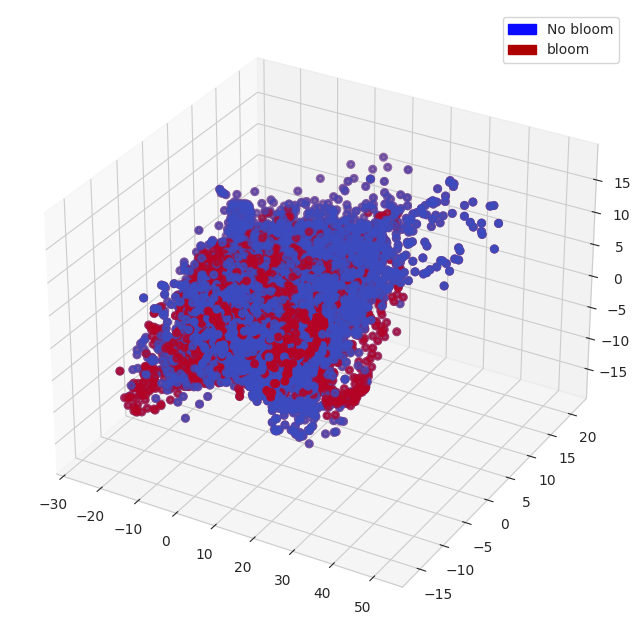

## Modeled data

The idea is to take the modeled data and train a machine learning (ML) model on that data, then try to use it on the observational data.
The reason - models can't predict very well the exact time and location of algae blooms but they reproduce the physics/biogeochemistry of it.
Thus, the intuition to check is that a ML model trained on modelled data will be able to predict blooms on observational data.
We train a neural net model to distinguish bloom events (label = 1) from all other conditions (label = 0). 

### Input data

We use the modeled data, which comes from the ROMS+NERSEM hydro-physical-biogeochemical model of the Hardangerfjord system and has weekly averages of plenty of seawater parameters.
The input data for the neural net model includes modeled nutrients (PO4, NO3, Si) and density profiles at different ROMS nodal points. 
We do not take more parameters to be closer to real observations we can get from existing monitoring programs. 

### Labeling

Labeling is based on future increments of diatoms carbon concentration. 
Label is 1 when ‘normalized next week carbon’ - ‘normalized current week carbon’ > 0.2. 
All other points are label = 0.

Example of input data and labels (before normalization):

For predictitons we use:
`N1_p` is PO4, 
`N3_n` is NO3, 
`N5_s` is Si
and density profiles (1 to 25 columns).

Labeling example, Diatoms Carbon concentration (mg/l) from a ROMS nodal point (station) during a modeled year:

Red dots - label = 1 (bloom).

### Results

For Principal Component Analysis and a Decision Tree classifier we preprocess modeled data as follows.
Instead of snapshots we use increments of variables for 1 and 2 successive periods.

For example, for N5_s (Si) there are 2 data points at 2007-02-01: 
1. a difference between 2007.01.18 and 2007-02-01; 
2. a difference between 2007.01.25 and 2007-01-01.

Then we normalize all the data columnwise.
Thus, each input data record / vector has 56 points / dimensions (2 x (PO4 + NO3 + Si + 25 density points)).

#### Principal Component Analysis (PCA)

PCA is a dimensionality reduction algorithm and it can help to understand / visualize the data structure.
We project our observation vectors (of 56 dimenstions) to 3 dimensions and visualize them.
Also, we add bloom and no bloom tags on vectors.

In the resulting subspace blooms and no blooms are not linearly separable.
But there are some 'patches' of bloom and no bloom vectors.
That means that the distances between vectors in blooms / no blooms groups are smaller and groups can be identified.

#### Decision Tree classifier

#### Deep Learning

We experimented with taking 1 temporal point and several of them (for example, 3 points cover 3 weeks). 
Also we experimented using increments of parameters instead of their values. 
The results show that using more temporal points is beneficial and using increments instead of snapshot values slightly decreases the performance but reduces overfitting.

These are predictions for a couple of ROMs nodal points from a test set. 
So, the model has not seen that data before. 
I separated a train set from a test set temporally. 
This is the best approach for autocorrelated (correlation over time) data.

Blue line is carbon concentration (mg/l or something like that, I don’t remember exactly but it doesn’t matter).

Red triangles - are label=1. After them carbon concentration increase more or less significantly.

Cyan triangles - predictions of label=1.

The overall accuracy on the test set is about 60% with quite a lot of false positives. I suppose we can improve it, but essentially we should start using real observations. Also, I believe that taking data just from a point is not enough and the spatial coverage is important since the ocean is ‘moving’ all the time.
